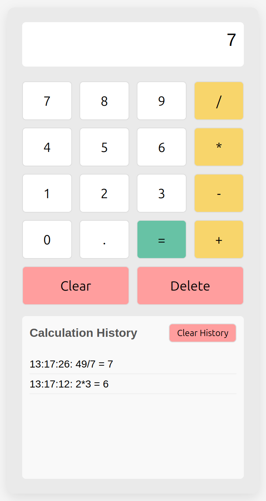

# Baue deinen eigenen Webrechner

In diesem Projekt erstellst du einen Taschenrechner, der in einem Webbrowser läuft. Du wirst HTML, CSS und JavaScript verwenden und den Rechner Schritt für Schritt aufbauen. Der Rechner wird folgende Funktionen beinhalten:

- Ein Anzeigebereich für die Rechnung und das Resultat
- Zifferntasten (0-9)
- Dezimalpunkt-Taste (.)
- Operationstasten (+, -, \*, /)
- Gleich-Taste (=)
- Löschen- und Zurück-Tasten
- Ein Verlaufsbereich, der frühere Berechnungen anzeigt

Beispielbild:

## Schritt 1: Erstelle die grundlegende HTML-Struktur

1. Erstelle eine neue Datei namens `calculator.html`
2. Richte die grundlegende HTML-Struktur ein mit:
   - Einem `
`-Container für den gesamten Rechner
   - Einem `
` für den Anzeigebereich
   - Einem `
` für alle Rechner-Tasten

## Schritt 2: Füge die Rechner-Tasten hinzu

Füge in deinem Tasten-Container folgendes ein:

- Tasten für Ziffern 0-9
- Dezimalpunkt-Taste (.)
- Tasten für Operationen (+, -, \*, /)
- Eine Gleich-Taste (=)
- Eine "Löschen"-Taste
- Eine "Zurück"-Taste

## Schritt 3: Gestalte deinen Rechner mit CSS

Füge CSS hinzu, um deinen Rechner ansprechend zu gestalten. Sorge als erstes dafür, dass die Tasten benutzerfreundlich angeordnet sind. Schaue dir dafür wenn nötig ein paar Bilder von Taschenrechnern im Internet an. **Tipp:** Versuche CSS Grid oder Flexbox zu verwenden, um deine Tasten anzuordnen.

Anschliessend kannst du dir nach deiner eigenen Vorstellung beispielsweise folgende Dinge überlegen:

- Gesamtabmessungen des Rechners und Hintergrundfarbe
- Position des Rechners auf der Webseite
- Gestaltung des Anzeigebereichs, um Eingaben und Resultate deutlich zu zeigen
- Gestaltung der Tasten mit unterschiedlichen Farben für Ziffern und Operatoren
- Hinzufügen von Hover-Effekten für bessere Benutzerinteraktion
- Gestaltung des Verlaufsbereichs, damit er sich vom Rest des Rechners abhebt
- usw.

## Schritt 4: Grundlegende JavaScript-Funktionalität für den Anzeigebereich hinzufügen

1. Erstelle eine Variable, um den Inhalt des Anzeigebereichs zu verfolgen. **Tipp:** Verwende `document.getElementById()` oder eine ähnliche Methode, um auf dein Anzeigeelement zuzugreifen.
2. Schreibe eine Funktion, die dem Anzeigebereich eine Zahl oder einen Operator hinzufügt. Benutze diese Funktion für die Tasten, um die angeklickte Zahl oder den Operator hinzuzufügen. **Tipp:** HTML-Elemente haben ein spezielles Attribut, welches bei einem Klick eine Funktion aufrufen kann.
3. Schreibe eine Funktion, die den Anzeigebereich leert, wenn die "Löschen"-Taste geklickt wird.
4. Schreibe eine Funktion, die das letzte Zeichen entfernt, wenn die "Zurück"-Taste geklickt wird.

## Schritt 5: Implementiere die Berechnungsfunktion

Schreibe eine Funktion, die:

1. Den Ausdruck im Anzeigebereich nimmt.
2. Ihn mathematisch auswertet.
3. Den Anzeigebereich mit dem Ergebnis aktualisiert.

**Tipp:** In JavaScript gibt es eine Funktion namens `eval()`, die String-Ausdrücke auswerten kann. Sei aber vorsichtig - sie hat Sicherheitsimplikationen in echten Anwendungen.

## Schritt 6: Richte einen Verlaufsbereich ein

Jetzt fügen wir einen Bereich hinzu, der frühere Berechnungen anzeigt.

1. Erstelle einen neuen HTML-Bereich für den Berechnungsverlauf:

   - Ein Container-`
` für den gesamten Verlauf
   - Eine Überschrift
   - Eine Liste für die Verlaufselemente
   - Eine Schaltfläche zum Löschen des Verlaufs

2. Füge CSS hinzu, um den Verlaufsbereich nach eigenen Wünschen zu gestalten.

## Schritt 7: Implementiere den Verlauf

1. Erstelle ein Array, um die vergangenen Berechnungen zu speichern.
2. Erweitere deine Berechnungsfunktion, um Berechnungen im Verlauf zu speichern. Füge dazu die Rechnung und ihr Resultat dem Verlaufs-Array hinzu.
3. Begrenze die Anzahl an Berechnungen, die im Verlauf gespeichert werden, damit der Verlauf nicht unaufhörlich wächst. Beispielsweise auf maximal 5 Berechnungen. **Tipp:** Überprüfe zu einem günstigen Zeitpunkt, ob mehr als die gewünschte Anzahl an Berechnungen im Verlauf sind und entferne die älteste Berechnung, falls dies der Fall ist.
4. Implementiere eine Funktion für das aktualisieren der Verlaufsanzeige, die:
   1. Eine Variable für den Zugriff auf das Verlaufslisten-Element erstellt.
   2. Den aktuellen Inhalt des Verlaufslisten-Elements löscht.
   3. Für jeden Eintrag im Verlaufs-Array ein neues Listenelement erstellt und der Verlaufsanzeige hinzufügt. **Tipp:** Verwende eine Schleife.
5. Rufe die neue Funktion auf, um die Verlaufsanzeige zu aktualisieren, wenn eine neue Berechnung dem Verlauf hinzugefügt wird.
6. Implementiere eine Funktion zum Löschen des Verlaufs und sorge dafür, dass sie mit einem Klick auf die Schaltfläche zum Löschen des Verlaufs aufgerufen wird.

## Schritt 8: Fehler und Grenzfälle behandeln

Verbessere deinen Rechner, indem du folgende Punkte berücksichtigst:

1. Was passiert, wenn ein Syntaxfehler im Ausdruck vorliegt?
2. Was passiert, wenn jemand versucht, mehrere Dezimalpunkte zu einer Zahl hinzuzufügen?
3. Was passiert, wenn das Ergebnis sehr groß oder sehr klein ist?

Füge Überprüfungen hinzu, um diese Fälle elegant zu behandeln.

## Zusätzliche Herausforderungen

1. Tastaturunterstützung: Erlaube, Zahlen und Operatoren mit der Tastatur zu tippen.
2. Speicherfunktion: Erlaube, Werte zu speichern und abzurufen.
3. Mehr Operationen: Implementiere mehr Operationen wie Quadratwurzel, Prozent, usw.
4. Klickbare Verlaufseinträge: Erlaube, Berechnungen im Verlauf anzuklicken, um sie abzurufen.
